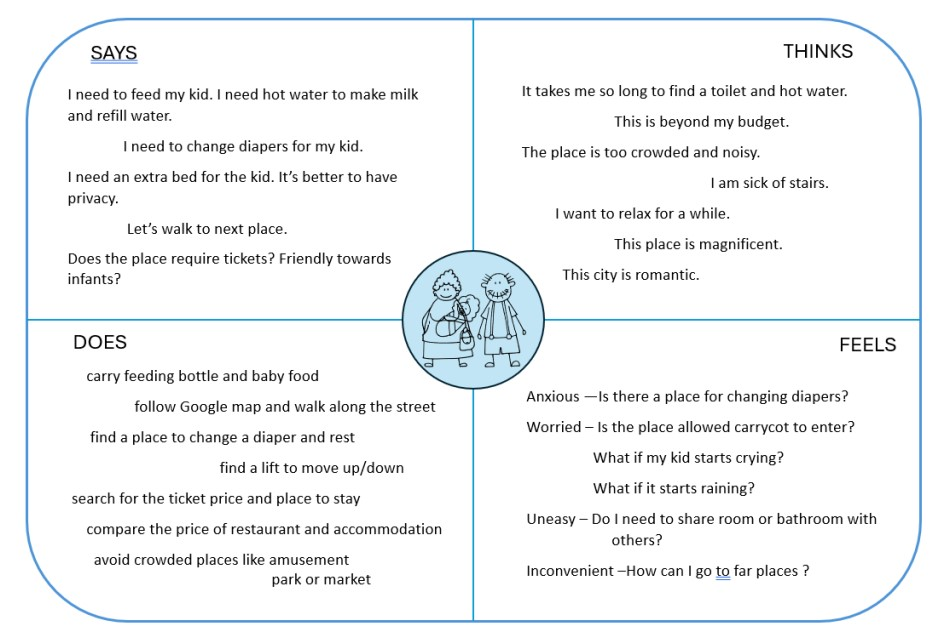

# Identify market gap to compete with Airbnb
Analysing data from Airbnb to identify the market gap. The city chosen is Paris, capital of Frence.

### Define the question
The objective of this report is to identify a market gap for competition with Airbnb. The
target demographic has been identified as low-income families with infants, and the city
under investigation is Paris.   

### Background research about Paris
In the begining , we start from discovering tourist spots, transportation, demographic, living expense and the house market 
of the city to gain a general idea of life living in Paris. 

  

 

### Empathy Map 
An empathy map is a collaborative visualisation used to articulate what we know about a particular type of user. 
By conducting the map, it is reasonable to estimate that the entirety of a trip for most travellers may span from 3 to 5
days, contingent upon the travellers' financial means and personal preferences.

 

From the empathy map, several points are found worth noticing: 
- Feeling tired comes frequently on the map, which implies they crave a cosy
accommodation to stay and it would be better to have privacy so that they won't be
bothered or disturbed by others. In addition, a deal that includes breakfast could save
some trouble. 
- They probably bring a carrycot and thus don't want to take the metro or tram to
move but the distance between spots is not worth taking a taxi, there may be a
trade-off between commuting fees and convenience.

### Analyse Airbnb data
Begin with data cleansing, by removing useless listings where the price equals zero or blank there are 67,108 remaining entries in
the dataset, , the majority of listings fell within the price range of 0 to 500€ dollars per night.

A label termed "level" was added manually which categorizes the data into six distinct segments. 

 

The listings were filtered to retain only those that satisfy the following criteria:
- The room type "shared room" is excluded from consideration, as the target group seeks rest without disturbance.
- The room must accommodate more than 2 beds, inclusive, to accommodate 2 adults
and a baby.
- The price has to be less than 100€ per night, as the target group have a limited
budget. 
- The location is preferably close to the city centre, as frequent use of public transport
may be inconvenient due to the carrycot.  

The dataset has been reduced from 2984 entries (satisfying the first four requirements) to 660 entries

 

The analysis reveals that the majority consist of entire apartments/homes accommodating 2 to 5
households within the same building. It seems likely that target group needs to tolerate
noise in some situations. 

 

Approximately 41.2% (185 out of 449) of listings are unavailable for booking within the next
30 days, and the remaining listings may have availability on specific days but offer limited
options overall.  

 

When analysing listing review, it becomes evident that the scores of candidate listings are
lower across various categories including check-in, cleanliness, communication, value, and
overall rating compared to average of all listings. The only exception is the location score, which is understandably higher due to our deliberate filtering
location.

 

### Analysis and conclusion 
This section try to address the question of what strategy could effectively compete with Airbnb based on the pain points generated from empathy map: 
- The target group seeks a room that offers privacy and tranquillity:  
It has been found that while Airbnb offers entire spaces, there is a high probability that
clients may encounter noise disturbances from neighbours. An alternative approach
could involve designing a well-utilized space capable of accommodating both business
activities in the morning and providing accommodations. However, due to the high
population density, there is a risk of compromising the advantage of a desirable location.
- Offering an appealing price with an acceptable level of quality is essential. 
While Airbnb provides a wide range of prices for clients, it often involves sacrificing some
quality. To enhance the rating and overall experience, implementing customized services
could be a beneficial approach. 

Airbnb's shortcomings, such as acceptance rate issues and low availability in city centres,
present opportunities for potential competitors.In summary, while a market gap exists, it is essential to personalize offerings to attract clients
with similar needs.

